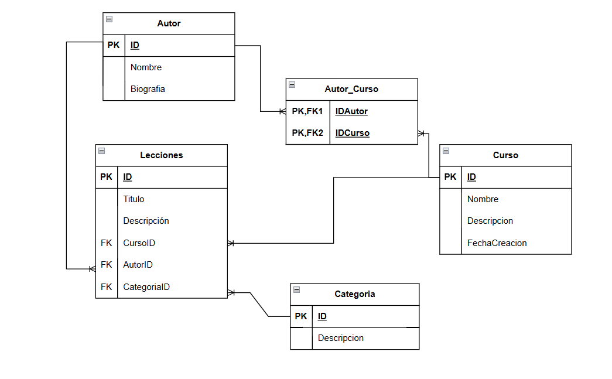
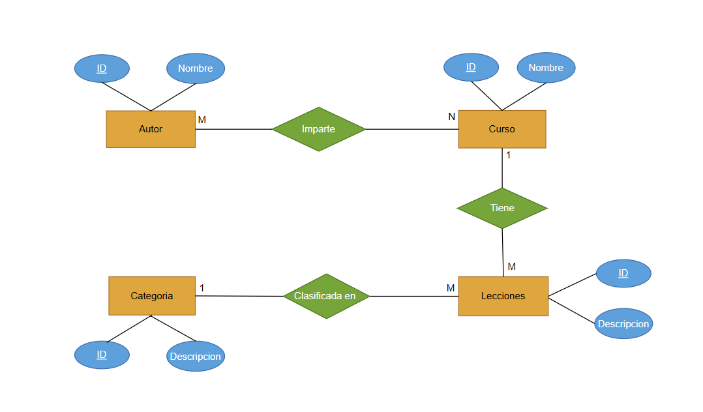

# Enunciado

Una startup tecnológica va a desarrollar un portal de ELearning y nos ha pedido que realizamos el modelo de datos de dicho sistema.

**A tener en cuenta:**

- Va a ser un portal orientado al mundo de la programación.
- El portal va a estar compuesto por cursos, cada curso está compuesto a su vez por un número de videos y artículos que lo acompañan.
- Lá página de cursos debe mostrar la lista de autores que lo hicieron.
- Lá página de un video debe mostrar el autor que lo realizó.
- Los videos y el contenido de cada artículo se almacenan en un storage S3 y en un headless CMS, en la base de datos sólo almacenaremos los Id's a esos recursos.
- Los videos se pueden clasificar por temáticas (Devops / Front End / Back End / ...) , para simplificar, un video va a pertenecer a una sóla temática.
- Los videos tienen autores (ponemos la restricción, un video tiene un autor), un curso puede tener varios autores.
- En principio los vídeos no se van a compartir entre diferentes cursos aunque sería una amplicacíon interesante del ejercicio.
- Hay una opcíon para ver la página con la biografía del autor.

## Parte obligatoria
Generar el modelo de entidad relación (físico), pero si quieres puedes generar también el de Chen para subir nota.

### El planteamiento quedaria de la siguiente manera

### Diagrama de chen

#### Colecciones y patrones utilizados:

- Cursos: contiene la información necesaria de los cursos
  - id
  - nombre
  - descripción
  - fechaCreación: para poder mostrar la fecha y buscar por ella
  Relacion 1 a M con lecciones ya que un curso puede contener muchas lecciones
  Relacion de M a N con una tabla intermedia con autores ya que un curso puede pertenecer a muchos autores y un autor puede haber hecho varios cursos

- Lecciones: contiene la informacion de los videos
  - id
  - titulo
  - descripcion
  Relacion de 1 a M con autores, ya que un autor puede haber hecho varias lecciones, pero una lección solo puede pertenecer a un autor
  Relacion de 1 a M con categorias ya que una leccion solo puede pertenecer a una categoria pero puede haber varias lecciones en la misma categoria

- Autores: con la información mas detallada de los autores y sus cursos
  - id
  - nombre
  - biografia
  Relacion de 1 a M con lecciones, ya que un autor puede haber hecho varias lecciones, pero una lección solo puede pertenecer a un autor
  Relacion de M a N con una tabla intermedia con cursos ya que un curso puede pertenecer a muchos autores y un autor puede haber hecho varios cursos
