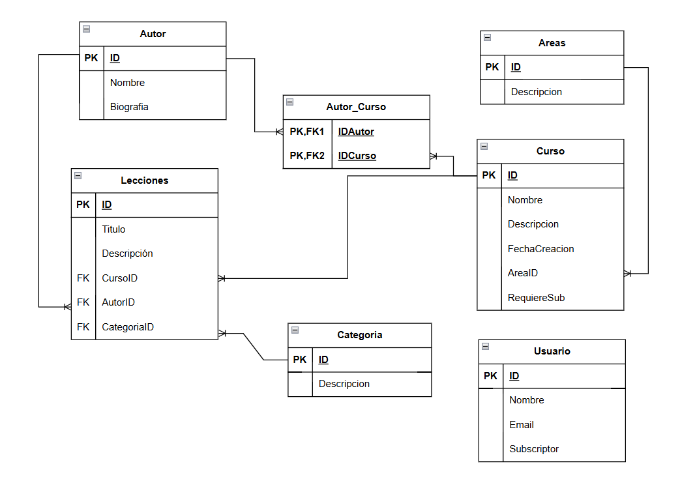

# Enunciado

Una startup tecnológica va a desarrollar un portal de ELearning y nos ha pedido que realizamos el modelo de datos de dicho sistema.

**A tener en cuenta:**

- Va a ser un portal orientado al mundo de la programación.
- El portal va a estar compuesto por cursos, cada curso está compuesto a su vez por un número de videos y artículos que lo acompañen.
- Lá página de cursos debe mostrar la lista de autores que lo hicieron.
- Lá página de un video debe mostrar el autor que lo realizó.
- Los videos y el contenido de cada artículo se almacenan en un storage S3 y en un headless CMS, en la base de datos sólo almacenaremos los Id's a esos recursos.
- Los videos se pueden clasificar por temáticas (Devops / Front End / Back End / ...)
- Los videos tienen autores (ponemos la restricción, un video tiene un autor), un curso puede tener varios autores.
- En principio los vídeos no se van a compartir entre diferentes cursos (aunque sería una amplicacíon interesante del ejercicio.
- Hay una opcíon para ver la página con la biografía del autor, esta página no va a ser muy visitada.

## Parte opcional
- Tener un sólo nivel de áreas es limitado, lo suyo sería tener una estructura jerárquica, por ejemplo:
  - Front End >> React
  - Front End >> React >> Testing
  - Front End >> Angular
  - Devops >> Dockers
  - Devops >> Serverless
  - Backend >> nodejs
  - Backend >> nodejs >> Express
  - Backend >> mongo

- Van a haber videos publicos y privados, es decir:
  - Un curso puede ser 100% publico.
  - Un curso puede tener una parte inicial 100% pública, y otra sólo para subscriptores.
  - Esto implica que hayan usuarios registrados y subscripciones.

  ### El planteamiento quedaria de la siguiente manera
  
  
  
  
  #### Colecciones y patrones utilizados:

- Cursos:
  - requiereSub: campo boleano para saber si todo el curso es gratuito o solo para suscriptores
  - ancestros: array para la estructura jerarquica

- Lecciones:
  - requiereSub: campo booleano para saber si la leccion del curso es gratuita o solo para suscriptores

- Areas: añadida coleccion para tener las categorias de los cursos
  - id
  - nombre
  - ancestros: array

- Usuarios: añadida coleccion para controlar si son usuarios registrados o suscritos
  - id
  - nombre
  - email
  - suscriptor: booleano para comprobar si es suscriptor o no
